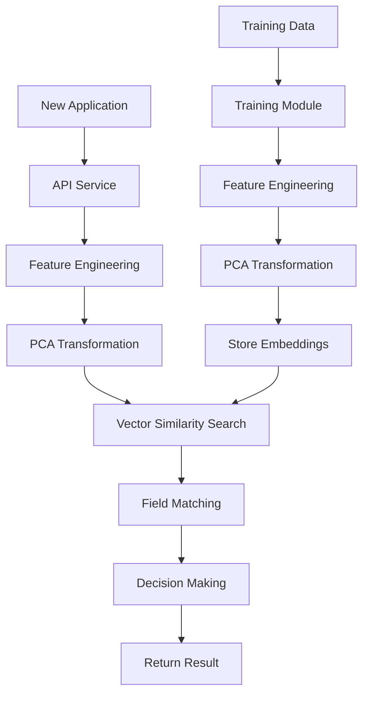

# Fraud Detection System

A system for detecting fraudulent merchant applications using vector similarity search and pattern matching.

## System Architecture

The system consists of three main components:

1. **Training Module** (`fraud_detection_training`):
   - Generates synthetic training data
   - Creates and populates the database with merchant records
   - Handles vector embeddings for similarity search

2. **API Module** (`fraud_detection_api`):
   - Provides REST API endpoints for fraud detection
   - Implements pattern matching and similarity search
   - Returns detailed fraud analysis results

3. **Common Module** (`fraud_detection_common`):
   - Shared utilities and configurations
   - Database operations
   - Dynamic model generation

## Navigation

- [Project Structure](#project-structure)
- [Prerequisites](#prerequisites)
- [Setup](#setup)
- [Usage](#usage)
- [How It Works](#how-it-works)
- [System Flow](#system-flow)
- [Development](#development)
- [Contributing](#contributing)
- [License](#license)
- [Acknowledgments](#acknowledgments)

## Project Structure

The system is divided into three main components:

1. **fraud_detection_common** - Shared utilities and models
   - Database operations with pgvector
   - Custom embedding generation using feature engineering and PCA
   - Dynamic model generation based on configuration
   - Common data models and types

2. **fraud_detection_training** - Training and embedding generation
   - Processes training data from JSON or CSV files
   - Generates custom embeddings
   - Stores embeddings in the database

3. **fraud_detection_api** - API service
   - FastAPI-based REST API
   - Evaluates new applications
   - Returns fraud detection results

## System Flow



## Prerequisites

- Python 3.9+
- PostgreSQL 15+ with pgvector extension
- Docker and Docker Compose (for containerized deployment)
- Make (optional, for using Makefile commands)

## Local Development Setup

### 1. Create and Activate Virtual Environment

```bash
# Create virtual environment
python -m venv .venv

# Activate virtual environment
# On macOS/Linux:
source .venv/bin/activate
# On Windows:
.venv\Scripts\activate
```

### 2. Install Dependencies

```bash
# Install common module
pip install -e fraud_detection_common/

# Install training module
pip install -e fraud_detection_training/

# Install API module
pip install -e fraud_detection_api/
```

### 3. Database Setup

```bash
# Start PostgreSQL with pgvector
docker compose up -d db

# Wait for database to be ready
docker compose exec db pg_isready -U postgres
```

### 4. Run Training Module

```bash
# Generate training data and populate database
python -m fraud_detection_training.train
```

### 5. Run API Module

```bash
# Start the API server
python -m fraud_detection_api.api
```

## Docker-based Deployment

### 1. Build and Start Services

```bash
# Build all services
docker compose build

# Start all services
docker compose up -d
```

### 2. Check Service Status

```bash
# View logs
docker compose logs -f

# Check service status
docker compose ps
```

### 3. Stop Services

```bash
# Stop all services
docker compose down

# Stop and remove volumes
docker compose down -v
```

## API Usage

### 1. Check API Schema

```bash
# Get API schema
curl http://localhost:8000/schema
```

### 2. Submit Merchant Application

```bash
# Submit a merchant application for fraud detection
curl -X POST http://localhost:8000/predict \
  -H "Content-Type: application/json" \
  -d '{
    "merchant_id": "test-merchant-1",
    "owner_ssn": "123-45-6789",
    "business_fed_tax_id": "12-3456789",
    "owner_drivers_license": "DL12345678",
    "business_phone_number": "+1-555-123-4567",
    "owner_phone_number": "+1-555-987-6543",
    "email": "merchant@example.com",
    "address_line1": "123 Main St",
    "city": "New York",
    "state": "NY",
    "zip_code": "10001",
    "country": "US",
    "website": "https://example.com"
  }'
```

## Development Workflow

### 1. Local Development

```bash
# Start database
docker compose up -d db

# Install dependencies
pip install -e fraud_detection_common/
pip install -e fraud_detection_training/
pip install -e fraud_detection_api/

# Run training
python -m fraud_detection_training.train

# Run API
python -m fraud_detection_api.api
```

### 2. Docker Development

```bash
# Build and start services
docker compose up --build

# View logs
docker compose logs -f

# Stop services
docker compose down
```

## Configuration

The system uses a centralized configuration in the `config/` directory:

- `database_config.json`: Database connection settings
- `database_config.local.json`: Local development overrides

To modify configuration:

1. Copy the template:
```bash
cp config/database_config.json config/database_config.local.json
```

2. Edit the local configuration file with your settings

## Troubleshooting

### Database Connection Issues

```bash
# Check database status
docker compose exec db psql -U postgres -c "\l"

# Check table structure
docker compose exec db psql -U postgres -d fraud_detection -c "\dt"
```

### Service Logs

```bash
# View API logs
docker compose logs -f api

# View training logs
docker compose logs -f training

# View database logs
docker compose logs -f db
```

## Contributing

1. Fork the repository
2. Create a feature branch
3. Make your changes
4. Submit a pull request

## License

This project is licensed under the MIT License - see the LICENSE file for details.

## Acknowledgments

- [pgvector](https://github.com/pgvector/pgvector) for vector similarity search
- [FastAPI](https://fastapi.tiangolo.com/) for the API framework
- [scikit-learn](https://scikit-learn.org/) for feature engineering and PCA 