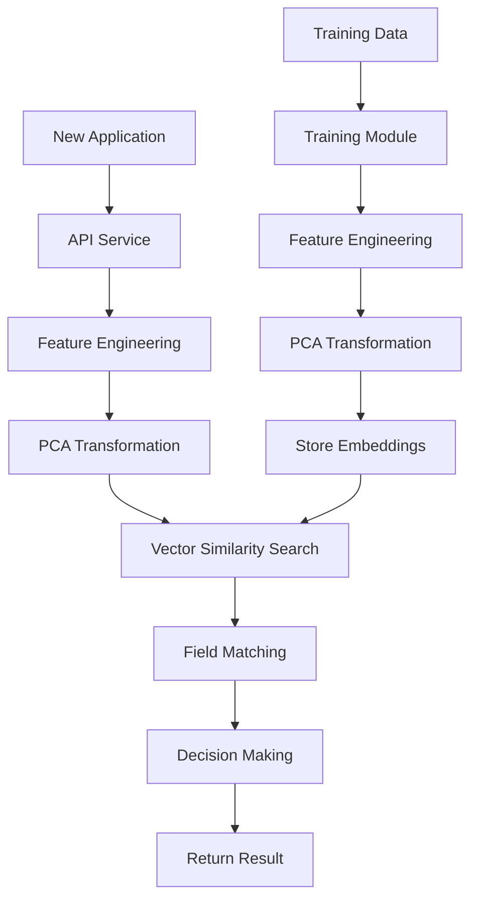

# Fraud Detection System

A modular fraud detection system that uses custom feature engineering and vector similarity search to identify potentially fraudulent merchant applications.

## Navigation

- [Project Structure](#project-structure)
- [Prerequisites](#prerequisites)
- [Setup](#setup)
- [Usage](#usage)
- [How It Works](#how-it-works)
- [System Flow](#system-flow)
- [Development](#development)
- [Contributing](#contributing)
- [License](#license)
- [Acknowledgments](#acknowledgments)

## Project Structure

The system is divided into three main components:

1. **fraud_detection_common** - Shared utilities and models
   - Database operations with pgvector
   - Custom embedding generation using feature engineering and PCA
   - Dynamic model generation based on configuration
   - Common data models and types

2. **fraud_detection_training** - Training and embedding generation
   - Processes training data from JSON or CSV files
   - Generates custom embeddings
   - Stores embeddings in the database

3. **fraud_detection_api** - API service
   - FastAPI-based REST API
   - Evaluates new applications
   - Returns fraud detection results

## System Flow



## Prerequisites

- Python 3.9+
- PostgreSQL 13+ with pgvector extension
- Docker and Docker Compose (optional, for local development)

## Setup

1. **Environment Setup**
   ```bash
   # Create and activate virtual environment
   python -m venv .venv
   source .venv/bin/activate  # On Windows: .venv\Scripts\activate

   # Install dependencies for each package
   cd fraud_detection_common && pip install -e .
   cd ../fraud_detection_training && pip install -e .
   cd ../fraud_detection_api && pip install -e .
   ```

2. **Database Setup**
   ```bash
   # Using Docker Compose
   docker-compose up -d

   # Or manually install PostgreSQL and pgvector
   # Follow pgvector installation instructions for your OS
   ```

3. **Environment Variables**
   Create a `.env` file in the root directory:
   ```
   DB_NAME=fraud_db
   DB_USER=postgres
   DB_PASSWORD=postgres
   DB_HOST=localhost
   DB_PORT=5432
   ```

## Usage

1. **Configuration**
   The system uses a configuration-driven approach. Create a `config/model_config.json` file:
   ```json
   {
     "name": "merchant_fraud",
     "fields": [
       {
         "name": "owner_ssn",
         "type": "string",
         "validation": {
           "pattern": "^\\d{3}-\\d{2}-\\d{4}$"
         }
       },
       {
         "name": "business_fed_tax_id",
         "type": "string",
         "validation": {
           "pattern": "^\\d{2}-\\d{7}$"
         }
       }
     ],
     "feature_groups": [
       {
         "name": "identity",
         "fields": ["owner_ssn", "business_fed_tax_id"]
       }
     ],
     "similarity_thresholds": {
       "decline": 0.8,
       "review": 0.6
     }
   }
   ```

2. **Training the Model**
   ```bash
   cd fraud_detection_training
   python -m src.train
   ```
   The training script supports both JSON and CSV formats:

   **JSON Format:**
   ```json
   [
     {
       "application": {
         "owner_ssn": "...",
         "business_fed_tax_id": "...",
         "owner_drivers_license": "...",
         "business_phone_number": "...",
         "owner_phone_number": "...",
         "email": "...",
         "address_line1": "...",
         "city": "...",
         "state": "...",
         "zip_code": "...",
         "country": "...",
         "website": "..."
       },
       "fraud_reason": "Reason for fraud"
     }
   ]
   ```

   **CSV Format:**
   ```csv
   owner_ssn,business_fed_tax_id,owner_drivers_license,business_phone_number,owner_phone_number,email,address_line1,city,state,zip_code,country,website,fraud_reason
   123-45-6789,12-3456789,DL12345678,555-123-4567,555-987-6543,test@example.com,123 Main St,New York,NY,10001,US,www.example.com,Reason for fraud
   ```

3. **Running the API**
   ```bash
   cd fraud_detection_api
   uvicorn src.api:app --reload
   ```

4. **Evaluating Applications**
   ```bash
   curl -X POST http://localhost:8000/evaluate \
     -H "Content-Type: application/json" \
     -d '{
       "owner_ssn": "123-45-6789",
       "business_fed_tax_id": "12-3456789",
       "owner_drivers_license": "DL12345678",
       "business_phone_number": "555-123-4567",
       "owner_phone_number": "555-987-6543",
       "email": "test@example.com",
       "address_line1": "123 Main St",
       "city": "New York",
       "state": "NY",
       "zip_code": "10001",
       "country": "US",
       "website": "www.example.com"
     }'
   ```

## How It Works

1. **Dynamic Model Generation**
   - Models are generated based on configuration
   - Supports custom field types and validation rules
   - Feature groups for organized feature engineering
   - Configurable similarity thresholds

2. **Feature Engineering**
   - Identity Features:
     - Owner SSN (hashed)
     - Business Tax ID (hashed)
     - Driver's License (hashed)
   - Contact Features:
     - Business Phone (hashed)
     - Owner Phone (hashed)
     - Email (hashed)
   - Location Features:
     - Address (hashed)
     - City (hashed)
     - State (hashed)
     - ZIP Code (hashed)
     - Country (hashed)
   - Business Features:
     - Website (hashed)

3. **Embedding Generation**
   - Features are normalized using StandardScaler
   - PCA reduces dimensions to 384 features
   - Embeddings are stored as float32 vectors

4. **Similarity Search**
   - Uses pgvector for efficient cosine similarity search
   - Thresholds for decision making:
     - > 0.8: Decline
     - > 0.6: Review
     - Otherwise: Approve

5. **Field Matching**
   - Dynamic field comparison based on configuration
   - Case-insensitive comparison
   - Returns detailed match information

## Development

Each package follows a similar structure:
```
package_name/
├── pyproject.toml      # Package configuration and dependencies
├── src/               # Source code
│   └── package_name/  # Package modules
└── tests/             # Test files (when added)
```

## Contributing

1. Fork the repository
2. Create a feature branch
3. Make your changes
4. Run tests (when added)
5. Submit a pull request

## License

[Add your license here]

## Acknowledgments

- [pgvector](https://github.com/pgvector/pgvector) for vector similarity search
- [FastAPI](https://fastapi.tiangolo.com/) for the API framework
- [scikit-learn](https://scikit-learn.org/) for feature engineering and PCA 